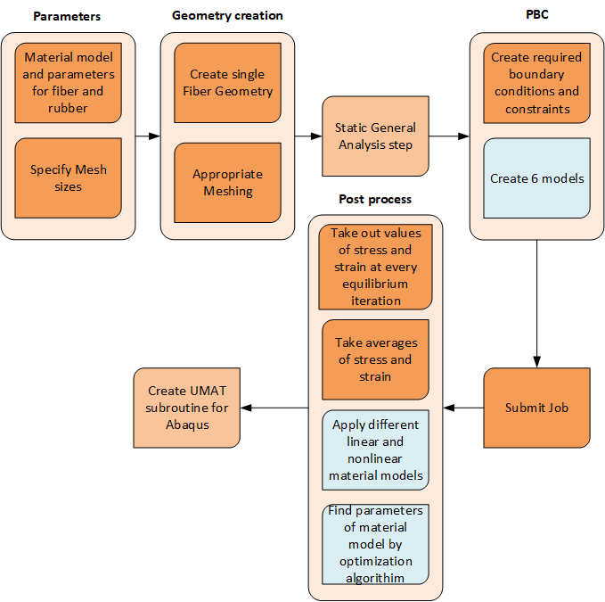

# Repository Description

## Overview
This is the extension of the code [link](https://github.com/Jamal-dev/PBC_Linear "PBC code based on linear analysis"). This repo implements the periodic boundary condition for the general static analysis step in Abaqus.

## Usage
The plugin operates through main steps:

1. **Parameter Specification:** Users define parameters for fiber and matrix materials, along with Representative Volume Element (RVE) dimensions.
2. **Geometry Creation:** The plugin generates the RVE geometry based on specified parameters and creates a mesh ensuring consistent node positions on opposite faces.
3. **Static General Analysis step:** The plugin defines a static general analysis step.
4. **Periodic Boundary Conditions (PBC):** Essential boundary conditions are set up using a pair function, establishing 'master' and 'slave' nodes on opposite faces.
5. **Job Submission:** The plugin submits the job for analysis.
6. **Post-Processing:** Results are post-processed, including material homogenization scenarios and the derivation of simplified material models.

## Parameters
In the parameter section, users specify material properties, RVE dimensions, and utilize a unique approach to derive RVE dimensions based on the number of fibers, fiber diameter, and volume fraction of the fiber.

## Geometry Creation Module
This module focuses on creating RVE geometry based on specified dimensions and fiber diameter, including mesh generation for subsequent analysis.

## Analysis Step
The primary analysis involves a static linear perturbation, defining field output variables such as strain, logarithmic strain, total strain, stress, displacements, and integration point volume.

## Periodic Boundary Condition (PBC) Module
This module establishes essential boundary conditions using a pair function, defining 'master' and 'slave' nodes on opposite faces.

## Post-Processing
Adjustments to the post-processing of the plugin are necessary, considering the availability of information beyond two points. Options include using regression analysis to determine unknowns of the linear model or employing various homogenization scenarios involving the engineering of the strain energy function. To find the unknowns of these models, optimization algorithms are required.

## Running the Code
1. Change Abaqus directory to the plugin directory (`File->Set Work Directory..-> Plugin_directory`).
2. Run the main file (`File->Run script...->main.py`).

This tool automates the evaluation of homogenization scenarios, aiding engineers and researchers in developing accurate and computationally efficient material models for complex simulations.